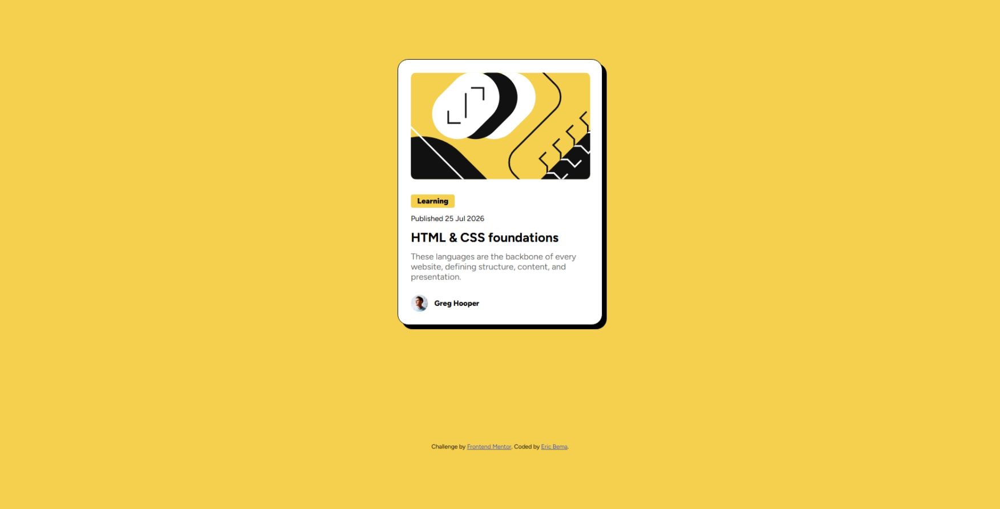

# Frontend Mentor - Blog preview card solution

This is a solution to the [Blog preview card challenge on Frontend Mentor](https://www.frontendmentor.io/challenges/blog-preview-card-ckPaj01IcS). Frontend Mentor challenges help you improve your coding skills by building realistic projects. 

## Table of contents

- [Overview](#overview)
  - [The challenge](#the-challenge)
  - [Screenshot](#screenshot)
  - [Links](#links)
- [My process](#my-process)
  - [Built with](#built-with)
  - [What I learned](#what-i-learned)
  - [Continued development](#continued-development)
  - [AI Collaboration](#ai-collaboration)
- [Author](#author)

## Overview

### The challenge

Users should be able to:

- See hover and focus states for all interactive elements on the page

### Screenshot

### Links

- Solution URL: 
- Live Site URL: 

## My process

### Built with

- Semantic HTML5 markup
- CSS custom properties
- Flexbox
- CSS Grid
- Mobile-first workflow

### What I learned

I learned to easily scale down font sizes for smaller screens by taking use of relative units.

### Continued development

I am still yet to perfect typography and sizing of elements. I also struggle with working with svg elements. Through continued exercises i can definitely get better

### AI Collaboration

I used AI sparingly when i made this

- I used the inbuilt vscode chat
- I used it to help me figure out a problem i couldn't quite figure out plus i used it to help me generate useful commit message

## Author

- Frontend Mentor - [@EricBema](https://www.frontendmentor.io/profile/EricBema)
- Github - [EricBema](https://github.com/EricBema)
